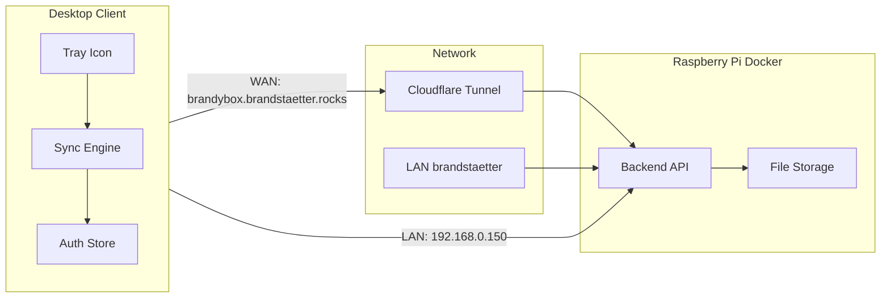

# Brandy Box – Full implementation plan

## Scope summary

- **Desktop client**: Python app with system tray, sync status, settings (local folder choice), login; runs on Windows, Linux, Mac; installable without admin (per-user).
- **Backend**: Python service in Docker on Raspberry Pi; serves API + file storage under `/mnt/shared_storage/brandyBox/<email>/`; user/admin management; sends password by email.
- **Access**: Public via `brandybox.brandstaetter.rocks` (Cloudflare tunnel); on LAN `brandstaetter` use `192.168.0.150`.
- **Deliverables**: Logos, installers for all three OSes, README, in-code docs, and auto-generated/updated dev documentation; security and structure aligned with the security-review skill and OOP/packages.

---

## Architecture




- **Repo layout**: Two main trees — `client/` (desktop app) and `backend/` (Raspberry Pi service). Shared code (e.g. API contracts) can live in a small `shared/` or be duplicated if kept minimal.
- **Backend**: One Docker container (Python 3.11+), FastAPI or Flask. Responsibilities: auth (JWT or session cookies over HTTPS), user CRUD (admin-only), per-user paths under `/mnt/shared_storage/brandyBox/<email>/`, file upload/download/list, optional conflict metadata.
- **Client**: Single process: tray (pystray), sync loop (compare local vs API list, upload/download), auth (keyring + optional refresh token). No GUI beyond tray menu and a small settings window (e.g. folder picker, login form, admin panel for user create/delete).

---

## Technology choices


| Layer               | Choice                                                                                                                                                                     | Rationale                                                                      |
| ------------------- | -------------------------------------------------------------------------------------------------------------------------------------------------------------------------- | ------------------------------------------------------------------------------ |
| Desktop GUI / tray  | **pystray** + **Pillow** (tray), **tkinter** or **PyQt** (settings window)                                                                                                 | Cross-platform, no admin; pystray well-established for tray icons.             |
| Credential storage  | **keyring**                                                                                                                                                                | OS-backed (Windows Credential Manager, macOS Keychain, Linux Secret Service).  |
| HTTP client         | **httpx** or **requests**                                                                                                                                                  | Sync and API calls to backend.                                                 |
| Backend framework   | **FastAPI**                                                                                                                                                                | Async, OpenAPI, validation, easy to secure (middleware, dependency injection). |
| Backend auth        | **JWT** (access + short-lived) + **refresh token** (stored in keyring)                                                                                                     | Stateless; credentials never stored in plain text on client.                   |
| File sync           | Custom loop: list remote (API), list local (pathlib + watch or polling), diff, then upload/download in chunks                                                              | Keeps scope manageable; optional later: filesystem watcher for real-time.      |
| Backend persistence | **SQLite** (users, sessions) + filesystem for files                                                                                                                        | No extra DB server; SQLite in Docker volume.                                   |
| Email               | **smtplib** or **aiosmtplib** with env-based config (SMTP host, user, password, from-address)                                                                              | Password delivery for new users; configurable.                                 |
| Packaging           | **PyInstaller** (one-folder or one-file per platform)                                                                                                                      | Run without Python/admin; build per OS (no cross-compile).                     |
| Installers          | **Windows**: Inno Setup or NSIS (per-user dir); **Linux**: AppImage or script that extracts to `~/.local/share/brandybox` and adds `.desktop`; **Mac**: .app bundle in DMG | User-level install, no sudo/Admin.                                             |
| Docs                | **Sphinx** or **MkDocs** in repo; Cursor rule/skill to “regenerate docs when code changes”                                                                                 | Auto-generated API and module docs from docstrings.                            |


---

## Directory structure (target)

```
brandyBox/
├── client/                    # Desktop application
│   ├── brandybox/
│   │   ├── __init__.py
│   │   ├── main.py            # Entry: tray + sync loop
│   │   ├── tray.py            # pystray icon, menu, status
│   │   ├── sync/
│   │   │   ├── __init__.py
│   │   │   ├── engine.py      # Sync logic (diff, upload, download)
│   │   │   └── watcher.py     # Optional: inotify/fswatch
│   │   ├── api/
│   │   │   ├── __init__.py
│   │   │   └── client.py      # HTTP calls, base URL resolution
│   │   ├── auth/
│   │   │   ├── __init__.py
│   │   │   └── credentials.py # keyring + token refresh
│   │   └── ui/
│   │       ├── __init__.py
│   │       ├── settings.py    # Folder picker, login, admin
│   │       └── dialogs.py     # Warnings (e.g. folder clear)
│   ├── tests/
│   ├── pyproject.toml
│   └── README.md
├── backend/                   # Raspberry Pi service
│   ├── app/
│   │   ├── __init__.py
│   │   ├── main.py            # FastAPI app
│   │   ├── config.py         # Env (paths, SMTP, JWT secret)
│   │   ├── auth/
│   │   │   ├── __init__.py
│   │   │   ├── jwt.py
│   │   │   └── dependencies.py
│   │   ├── users/
│   │   │   ├── __init__.py
│   │   │   ├── models.py
│   │   │   ├── routes.py      # CRUD (admin), me
│   │   │   └── service.py    # Create user, send email
│   │   ├── files/
│   │   │   ├── __init__.py
│   │   │   ├── routes.py     # list, upload, download
│   │   │   └── storage.py    # Safe path under base dir
│   │   └── db/
│   │       ├── __init__.py
│   │       └── session.py
│   ├── Dockerfile
│   ├── docker-compose.yml
│   ├── requirements.txt
│   └── tests/
├── assets/                    # Logos and installer resources
│   ├── logo/
│   │   ├── icon_16.png
│   │   ├── icon_32.png
│   │   ├── icon_synced.png
│   │   ├── icon_syncing.png
│   │   └── icon_error.png
│   └── installers/            # Scripts / configs for installers
├── docs/                      # Generated dev documentation
│   └── (Sphinx/MkDocs output)
├── .cursor/
│   └── rules/
│       └── brandybox-rules.mdc  # OOP, packages, docstrings, regenerate docs
├── README.md                  # Installation and usage
└── prompt.txt
```

---

## Feature implementation (concise)

### 1. Backend (Raspberry Pi, Docker)

- **Config**: Base path `/mnt/shared_storage/brandyBox`, JWT secret and expiry, SMTP (host, port, user, password, from), SQLite path — all from env (no hardcoded secrets).
- **Auth**: Register/login returns access + refresh token; refresh endpoint; password hashing (e.g. bcrypt/argon2). Admin role stored in users table; first admin created via CLI or env (e.g. `BRANDYBOX_ADMIN_EMAIL` + initial password).
- **Users**: Table: email (PK), first_name, last_name, password_hash, is_admin, created_at. Admin-only: create user (generate temp password, send email, store hash), delete user (and optionally mark or remove user folder).
- **Files**: All file routes scoped to current user: path = `base / sanitize(email) / sanitize(relative_path)`. No `..`; allowlist for safe names. List (recursive), upload (multipart or chunked), download (stream).
- **Security (skill-aligned)**: Parameterized DB; no path traversal; rate limit login and file endpoints; HTTPS only in production; secure headers; no secrets in logs; CORS restricted to known origins.

### 2. Desktop client

- **Endpoint resolution**: If on network named `brandstaetter` (e.g. Windows: WLAN SSID; Linux: connection name; Mac: service name), use `http://192.168.0.150:<port>`; else `https://brandybox.brandstaetter.rocks`. Port configurable (e.g. 8080 for backend).
- **Login**: UI for email + password; on success store refresh token (and optionally email) in keyring; use access token in memory and refresh when 401.
- **Settings**: Choose local sync folder; show clear warning that existing content may be removed/replaced; persist path in user config (e.g. `~/.config/brandybox/` or per-OS equivalent).
- **Sync**: Loop (e.g. every N seconds) or after folder change: list local files, list remote via API, compute diff; upload new/changed, download new/changed; simple strategy (e.g. last-modified wins or conflict copy). Update tray state: synced / syncing / error.
- **Tray**: Icon with state (synced / syncing / error); menu: Open folder, Settings, Pause sync, Quit. Start minimized to tray; optional “Open settings” window.
- **Auto-start**: At user login only (no admin): Windows — shortcut in `%APPDATA%\...\Startup` or HKCU Run; Linux — `~/.config/autostart/brandybox.desktop`; Mac — Launch Agent in `~/Library/LaunchAgents/`. Toggle in settings.

### 3. Logos

- Generate or provide simple SVG/PNG set: main logo plus three states (synced, syncing, error). Use for tray and installer. Place in `assets/logo/` and reference from client and installer configs.

### 4. Installers

- **Windows**: PyInstaller one-folder build; Inno Setup (or NSIS) script installing to `%LOCALAPPDATA%\BrandyBox`, shortcut in Start Menu and optional Startup; no “Run as administrator”.
- **Linux**: PyInstaller build; script or AppImage that extracts to `~/.local/share/brandybox`, installs `.desktop` to `~/.local/share/applications`, optional autostart `.desktop` in `~/.config/autostart`.
- **Mac**: PyInstaller or py2app producing `.app`; DMG with drag-to-Applications; optional “Open at login” (Launch Agent) from app or first-run.

### 5. Documentation and quality

- **In-code**: Docstrings (Google or NumPy style) for public modules, classes, and key functions; type hints where practical.
- **Dev docs**: Sphinx or MkDocs in `docs/`; generated from docstrings + short hand-written overview; command in README (e.g. `make docs` or `mkdocs build`). Cursor rule: “When changing client or backend code, update or regenerate docs.”
- **README**: How to run backend (Docker on Pi), configure Cloudflare tunnel, set env (SMTP, admin); how to build and run client; how to create installers per OS; optional development setup.

### 6. Security and structure (skills)

- **Security**: Apply the [security-review skill](file:///home/markus/.cursor/skills/security-review/SKILL.md) to backend and client: checklist (injection, auth, path traversal, secrets, rate limiting, headers, errors); map findings to OWASP/CWE where relevant.
- **Structure**: OOP and packages as above; Cursor rule in `.cursor/rules/` requiring packages under `client/brandybox/` and `backend/app/`, no global mutable state, and “regenerate docs on significant change.”

---

## Assumptions and open decisions

1. **First admin**: Backend will support creating the first admin via env (e.g. `BRANDYBOX_ADMIN_EMAIL`, `BRANDYBOX_ADMIN_INITIAL_PASSWORD`) or a one-off CLI command; no public self-registration for admin.
2. **Email**: SMTP credentials and “from” address provided via env; no built-in provider (e.g. SendGrid) unless you add it later.
3. **Sync**: Bidirectional with a simple rule (e.g. newer file wins); conflict file created on same-time edits if needed. No version history in v1.
4. **Cloudflare**: Tunnel already points at the Pi; backend container exposes one HTTP port; tunnel config is your responsibility (redirect to that port). HTTPS termination can be at Cloudflare; backend may run HTTP behind tunnel unless you add TLS internally.
5. **Start on boot**: Implemented as “start at user login” (Startup folder, autostart `.desktop`, Launch Agent) since true boot-before-login requires admin.

---

## Implementation order (suggested)

1. **Repo and layout**: Create `client/`, `backend/`, `assets/`, `docs/`, and base files (e.g. `pyproject.toml`, `requirements.txt`, `.cursor/rules`).
2. **Backend core**: Config, DB (SQLite + user model), JWT auth, user routes (me, admin create/delete), email sending.
3. **Backend files**: Safe path resolution, list/upload/download routes, tests.
4. **Docker**: Dockerfile and docker-compose for Pi; document env and volume for `/mnt/shared_storage/brandyBox`.
5. **Client core**: Config, API client (base URL, auth headers), keyring auth, login UI.
6. **Client sync**: Sync engine (list, diff, upload/download), then tray with status.
7. **Client settings**: Folder picker, warning dialog, optional autostart toggle.
8. **Network detection**: LAN vs Cloudflare URL selection (SSID/connection name).
9. **Logos**: Create or add assets; wire tray and installers.
10. **Packaging**: PyInstaller spec per OS; then installer scripts (Inno/NSIS, Linux script/AppImage, Mac DMG).
11. **Docs and README**: Sphinx/MkDocs setup, README with install and run instructions.
12. **Security pass**: Full pass with security-review skill; fix and document.
13. **Cursor rule**: Rule for structure and “regenerate docs”; optional skill for doc refresh.

No code or repo changes have been made; this is a planning document only. If you want different tech choices (e.g. Electron instead of Python for UI) or different sync/conflict behavior, say so and the plan can be adjusted before implementation.